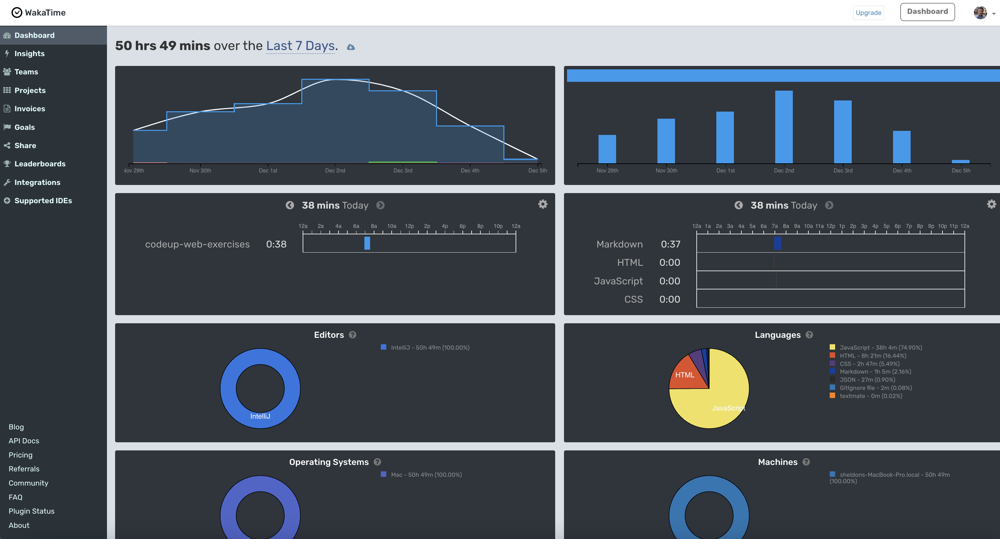

# Weather Map Project - Sheldon Pasciak, CodeUp - December 2023

I developed this project using the following technologies:

- Frontend libraries
    - Bootstrap 5.x.x. - https://getbootstrap.com/
    - Chart.js - https://www.chartjs.org/

- Third party API's
    - Mapbox GL JS - https://docs.mapbox.com/mapbox-gl-js/api/
    - OpenWeatherMap API - https://openweathermap.org/api
    - Request Bin - - https://public.requestbin.com/

## Development Environment

- IntelliJ - https://www.jetbrains.com/idea/
    - IntelliJ is a Java IDE, but it has a JavaScript plugin that allows for JavaScript development.
- VS Code - https://code.visualstudio.com/
    - VS Code is a JavaScript IDE that is used for JavaScript development.
- MySql Workbench - https://www.mysql.com/products/workbench/
    - MySql Workbench is a database IDE that is used for database development.
- FileZilla - https://filezilla-project.org/
    - FileZilla is an FTP client that is used to upload files to a web server. It was used to examine the results of
      .json files that were posted to the server from the application frontend.
- WakaTime - https://wakatime.com/
    - WakaTime is a plugin for IntelliJ and VS Code that tracks the amount of time spent on a project.

## Architecture & Lessons Learned

- Client - HTML, CSS, JavaScript and libraries mentioned above.
- Server - OpenWeatherMap API, Mapbox GL JS API, custom Node.js server(s).
    - NGINX - https://www.nginx.com/
        - NGINX is used to receive uploaded files from the client and to deliver the list of stored
          forecasts as well as an individual stored forecast. (JSON stored files)
        - NGINX is used with a backend Node.Js REST API server which receives and sends data to the
          client. (https://hidden.com:8181)
            - POST - /forecast
            - GET - /forecast
            - GET - /id/?id=123456789
                - The custom API backend server is written in plain JavaScript for an old version of node. It doesn't
                  use Express server so API routes were created plainly. Ideally, route parameter would be used instead
                  of the specific route for get by id.
        - NGINX is used with a backend Node.Js server as a socket listener to receive messages from the client. (
          WebSockets). This provides the live snapshot functionality where the current 'weather' can be shown.

- Raspberry PI - https://www.raspberrypi.org/
    - The Raspberry PI runs a webpage (autostart chrome local webpage with websocket connection) that serves as a remote
      chat client with access to a web camera, when a message is
      received from the server, the Raspberry PI takes a picture and sends it back to the server. The server then sends
      the picture to the client via WebSockets.
    - The Raspberry PI is running a local Node.js server that is used to shell a bash script that executes the image
      capture from the connected webcam. Once captured the image is converted into base64 and broadcast with websockets
      to the listening clients.

- Database - Request Bin
    - Forecasts for a given city can also be stored by posting JSON data to request bin. This is a free service that
      allows you to post data to a URL and then view the data in a web browser. This is a temporary solution until a
      database is implemented fully. It has only been implemented as a demonstration of database CRUD functionality
      opposed to data storage and retrieval in a file based system.
- Database - MySql
    - The database application of choice that would be used to store the list of forecasts and the individual forecasts.
    - Although a database table was created in a MySql database running at https://hidden.com, it hasn't been
      implemented because the extra work involved and time constraints meant that this project was better served by
      implementing frontend features instead. A future project will explore full database CRUD functionality.

- Deployment - Run locally for demo purposes, but can be deployed to a web server.

- Testing - Other than TDD, no testing framework is used.

## Project Requirements

A weather map that shows the current weather in the city the student lives in, and a five day
forecast for that city. The map should be interactive, and the user should be able to move the
marker to a different location, and the weather forecast should update to the new location.

Although the rubric mentions that only one marker is shown, I decided to implement additional features whereby following
that rubric requirement would not be in the best interests of this application's goals.

This is because I built a robust interface that allows the
user to search for a location, and then add that location to the map. The user can then click on the marker to see the
weather forecast for that location. The user can also remove the markers by using the HOME button. The user can also
drag
the marker to a new location, and the weather forecast will update to the new location.

The following images show all the features of the application and its related implementation.

## User interface Frontend

## Coding time spent, tracked with WakaTime

## Weather Map Rubric

For each project aspect below, a grade of 0, 0.5, or 1 will be assigned. Each aspect represents
10% of the total possible grade.

0 - mostly incomplete or not present

0.5 - partially completed

1 - mostly or fully complete

- ___ Shows current weather in city student lives in
- ___ Shows at least four days of forecasts for city student lives in (total of five days including
  current weather)
- ___ Page includes map with a marker on the location that the weather is shown for
- ___ User may move the marker by dragging, or may click on the map to add a new marker, in
  which case the old marker should disappear. Only one marker should be on the map at any
  given moment.
- ___ Weather forecast updates when marker is moved or replaced.
- ___ Text input is present that allows user to search for a place, and the forecast updates to the
  place the user searched for. Note: marker updating to the place the user searches for is not
  required (it's a bonus)
- ___ Project is cohesively styled
- ___ Code is organized according to best practices. There is a css and a js folder, no css or js on
  the html page

Weather Map Rubric
Instructions

Output (70%)
Code Quality (30%)

___ Code is formatted consistently with comments and whitespace making it easy to understand
where each part of the code is

___ Effective use of functions to encapsulate code